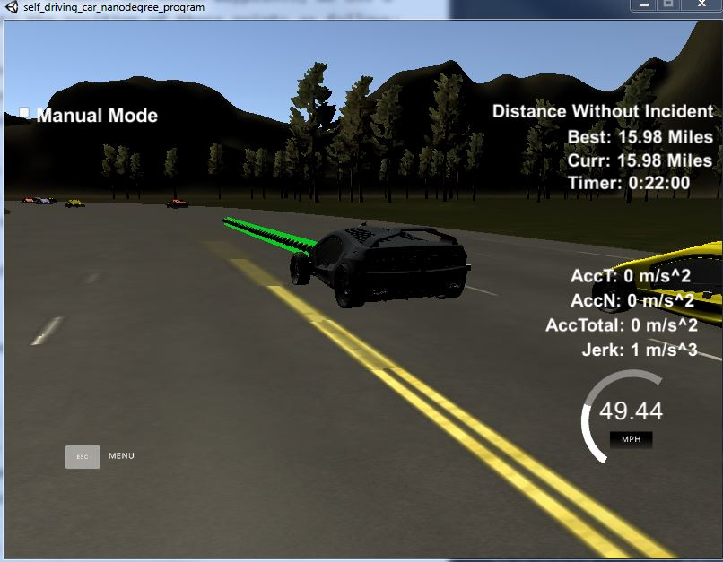

# Path Planner
Self-Driving Car Engineer Nanodegree Program

---
## Goal
The goal of this project is to design a path planner that is able to create smooth, safe paths for the car to follow along a 3 lane highway with traffic. A successful path planner will be able to keep inside its lane, avoid hitting other cars, and pass slower moving traffic all by using localization, sensor fusion, and map data.

The project consists of the following parts:

## Behavior Planning
A simple finite state machines is implemented with the following states:
- "KL": Keep Lane
- "LCL": Lane Change Left
- "LCR": Lane Change Right

By default the car will keep its current lane, unless it gets too close to the car in the front in the same lane (with distance less than 30 meters). In that case, it will check whether a Lane Change Left (if not on the left most lane) or Lane Change Right (if not on the right most lane) is safe. This is done using sensor fusion data to understand the vehicles in other lanes and estimate whether there would be any collisions if the ego car changes into that lane. When the distance between the ego car and the closest car in the front is greater than 35 meters, and the distance between the ego car and the closest car in the back is greater than 20 meters, a lane change will be made. 

The sensor fusion data is provided by the simulator for all other cars on the right side of the road. It contains a list of values [ id, x, y, vx, vy, s, d] for each car, where the id is a unique identifier for that car,  x and y values are in global map coordinates, and vx and vy values are the velocity components, also in reference to the global map. Finally s and d are the Frenet coordinates for that car. This information is used to predict where the cars will be in the future.

The code is in the method checkLaneChange() in behavior_planner.cpp (line 84-141).

## Trajectory Generation
Once it's decided whether the car should stay in its current lane, or change to left or right lane, we need generate a trajectory of points and send them to the simulator. Localization data (highway map) is provided, so we have a list of waypoints that go all the way around the track. To  generate the location of points between the known waypoints, we use a library spline to interpolate the position of those points as follows:

- Use the last two points from previous path, and three additional waypoints spaced at 30 meters interval, convert them into to local cooridanate frame, and interpolate a smooth path between these using spline.
- Generate a new path of 50 points, by re-using all points from previous path, plus remaining points that are evenly spaced out such that each point is traversed in 0.02 seconds with a reference speed (up to 50 miles per hour).
- These 50 points are transformed back to global coordinate frame and sent to the simulator.

The implementation is in the method generate() in trajectory.cpp (line 156-246).

To ensure that car does not drive above the speed limit, and it does not exceed a total acceleration of 10 m/s^2 and a jerk of 10 m/s^3, checks are put in place so that the car speed will not go above the limit, and for each 0.02 second, the accelaration is at most 0.224.   

Furthermore, since for each path generated we use three waypoints that are 30/60/90 meters from the last point from previous path, when the car gets close to the end of the track, these points will fall off from the waypoints and will cause either error with spline or max jerk exceeded. To address this, at the end the highway map I added 4 additional waypoints which coorelate to the first 4 points so that there are enough points to go through the whole track. This is implemented in main.cpp (line 81-92).

## Screenshots
A screenshot showing the car driving about 16 miles without incident:

Video of lane change:

